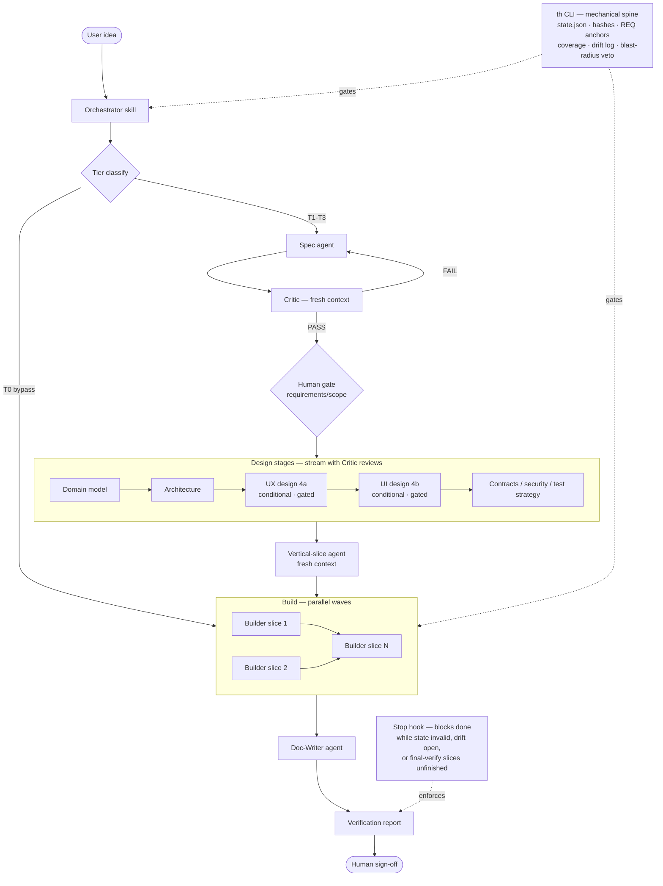

# TwinHarness

**Turns "build me X" into working, tested software** by forcing the idea through requirements, scope, design, and slice-by-slice implementation with verification gates — as a Claude Code plugin.

> **Early development notice.** TwinHarness is at v0.7.0. The pipeline has been exercised end-to-end and ships 1000+ tests, green on CI (1 platform-conditional skip in `tests/concurrency.test.ts` — POSIX-only permission-error case, intentionally skipped on Windows/root and covered on Linux/macOS CI), but it has limited real-world mileage and interfaces may change before 1.0. Expect breaking changes. Use it, push its limits, file issues — just don't bet a production release on it yet.

---

## What it is

TwinHarness is a Claude Code plugin: an agentic SDLC orchestrator that takes a vague software idea and produces working, tested software through a disciplined pipeline. It coordinates 16 specialized agents — a core pipeline of Orchestrator, Spec, Critic, Vertical-Slice, Builder, Test-Author, UX/UI-Designer (two ordered stages: 4a UX, 4b UI), Doc-Writer, Merge-Coordinator, Reconciler, Red-Team, and Librarian, plus on-demand Researcher, Debugger, Codebase-Inspector, and Tester — backed by a deterministic TypeScript CLI (`th`) that handles every mechanical operation: state, content hashing, REQ-ID traceability, coverage gates, the drift log, and a Stop hook that blocks Claude from claiming "done" while state is invalid or a blocking discovery is open.

Three things make it different from asking an agent to build something directly:

- **Artifacts govern; they don't decorate.** Every stage produces a document that downstream stages are mechanically checked against. When reality diverges during the build, the document updates — in both directions.
- **The process scales with risk, not ceremony.** A trivial change bypasses everything (Tier 0). A project touching auth, money, or migrations gets the strictest treatment, and that floor is enforced by code, not by promises.
- **Mechanical truths are code.** State, hashing, coverage, drift counts, and the completion gate live in a tested CLI — not in prompt text a model could misremember.

**Who it's for:** Claude Code users who want spec-driven, gated development instead of one-shot vibe-coding; people burned by agents that build the wrong thing or claim "done" when they aren't; teams that need traceability from requirements to code.

---

## Getting started

**Prerequisites:** Claude Code (≥ 1.0.0; targets the hook + agent manifest schema v1); Node >= 20 on PATH. On an older Node, `th` exits immediately with an upgrade pointer — install Node 20+ via [nvm](https://github.com/nvm-sh/nvm) (`nvm install 20`) or [nodejs.org](https://nodejs.org/).

### Install

The repo is its own single-plugin marketplace. From a local clone:

```
/plugin marketplace add C:\path\to\TwinHarness
/plugin install twinharness@twinharness
```

From GitHub directly:

```
/plugin marketplace add JrSneed28/TwinHarness
/plugin install twinharness@twinharness
```

For a throwaway trial without installing:

```
claude --plugin-dir C:\path\to\TwinHarness
```

The plugin installs at user scope and is available in every project.

#### Development / preview channel (`dev` branch)

The `dev` branch ships as its own marketplace, named `twinharness-dev`, so you can run the in-development build **side-by-side** with the stable `twinharness` channel above. Pin the marketplace to the `dev` ref with `@dev`:

```
/plugin marketplace add JrSneed28/TwinHarness@dev
/plugin install twinharness@twinharness-dev
```

The plugin name is still `twinharness`; only the marketplace differs (`@twinharness-dev` vs `@twinharness`), which is what lets both channels coexist. If you instead add a **local clone that is checked out on `dev`** (`/plugin marketplace add C:\path\to\TwinHarness`), it registers as `twinharness-dev` too — install it with `/plugin install twinharness@twinharness-dev`.

### First run

Open Claude Code in the directory where you want the software built (an empty directory is fine):

```
/twinharness:th-run build a CLI tool that tracks my reading list
```

### Slash commands

TwinHarness ships **16 slash commands** — 4 you drive a run with, plus 12 thin wrappers over the most-used `th` verbs (handy for inspecting a run without typing the full CLI path).

**Core run commands:**

| Command | What it does |
|---|---|
| `/twinharness:th-run [--interview] [--cutoff <0..1>] <idea>` | Start a new run, or resume an interrupted one (it picks up from `state.json`) |
| `/twinharness:th-status` | Tier, current stage, gates, slices, open drift — at a glance |
| `/twinharness:th-drift` | Review the drift log: skim auto-applied doc updates, decide blocked escalations |
| `/twinharness:th-escalate` | Show everything currently waiting on a human decision |

Pass `--interview` to open a confidence-scored Socratic loop that sharpens the brief before tier classification (default cutoff 0.80; see [USAGE.md](./USAGE.md) for the full flag reference and interview gate details).

**Inspection & verb wrappers:** `/twinharness:th-init`, `th-doctor`, `th-next`, `th-scorecard`, `th-stage`, `th-verify`, `th-coverage`, `th-tier`, `th-route`, `th-repo`, `th-test`, and `th-decision-approve` (the human-only decision gate). Each maps to the matching `th` command documented in [USAGE.md](./USAGE.md) Part 3.

### Run the test suite (from a clone)

```
npm install
npm test
```

The full guide — tiers, stages, the Critic loop, drift, gates, and the complete CLI reference — is in [USAGE.md](./USAGE.md).

---

## What a run looks like

Start with:

```
/twinharness:th-run build a CLI tool that tracks my reading list
```

Then, roughly:

1. **Scaffolding.** The Orchestrator initializes `docs/`, `.twinharness/state.json`, and `drift-log.md` in your project directory.
2. **Requirements.** A Spec agent drafts requirements, assigns REQ-IDs, and asks you only the questions that matter. A fresh-context Critic reviews the draft.
3. **Your first gate.** You see the requirements and are asked to approve or request changes. Once you sign off, requirements are sticky — only you can reopen them.
4. **Tier classification.** The Orchestrator sizes the project (Tier 0–3). Trivial → Tier 0 bypass. Risky blast-radius work → Tier 3 with more gates and more expensive models.
5. **Design stages stream.** Domain model, architecture, contracts, security/failure analysis, and test strategy run with Critic reviews but without interrupting you — except for genuinely irreversible choices (e.g. monolith vs. services) and blast-radius decisions (e.g. the auth scheme). If your project has a UI, the UX/UI-Designer runs two ordered stages — Stage 4a (UX: research, journeys, information architecture) then Stage 4b (UI: visual direction, screens, tokens) — and presents 2–3 directions at each, asking you to pick one before it details that stage.
6. **Vertical slices, then build.** A fresh-context agent decomposes the design into thin end-to-end slices. Builders implement them one-by-one (in conflict-free parallel waves when slices are independent), tests included, with a Critic after each.
7. **Documentation.** A Doc-Writer agent generates tier-appropriate docs. Critic-reviewed; no human gate.
8. **Verification.** A final report separates what the Critic can certify (coherence) from what only tests and you can certify (correctness). You sign off.

### Architecture



---

## Non-Goals

TwinHarness is deliberately NOT these things — naming them keeps the promise honest:

- **Not a general autonomous agent.** It will not pick your auth scheme, your database, or any blast-radius decision for you. The model proposes; you decide. Those gates are enforced by code, not etiquette.
- **Not a one-shot "vibe-coding" tool.** If you want a quick throwaway script with no spec, no gates, and no traceability, this is the wrong tool — use a bare agent. TwinHarness trades speed for governance.
- **Not a CI system, test runner, or build tool.** It *records* your project's own verify commands (`th verify`) and gates on their results; it does not replace your test framework, linter, or CI.
- **Not an IDE pair-programmer.** It is a pipeline orchestrator, not an inline autocomplete or chat-in-editor assistant.
- **Not a sandbox.** The write-gate and TTY/human gates bind a *compliant* agent inside Claude Code; they are guardrails, not a security boundary against a hostile process (see [SECURITY.md](./SECURITY.md)).
- **Not a model or a hosted service.** It is a Claude Code plugin: prompt orchestration plus a zero-dependency local CLI. Nothing leaves your machine unless you ask it to.

## How it compares

| Tool | One-line difference |
|---|---|
| **Aider** | Aider is a fast in-terminal edit/commit pair-programmer; TwinHarness is a multi-stage SDLC pipeline with requirements, gates, and REQ-ID traceability before any code is written. |
| **OpenHands** (ex-OpenDevin) | OpenHands is a general autonomous-agent runtime that executes broadly; TwinHarness deliberately *constrains* autonomy with human gates and a code-enforced completion check. |
| **GitHub Spec Kit** | Spec Kit scaffolds a spec-driven workflow as docs/templates; TwinHarness makes the spec *mechanically governing* — coverage, drift, and the Stop hook enforce it, not convention. |
| **BMAD-Method** | BMAD is a prompt/agent methodology you assemble; TwinHarness ships the same agent-team idea *with* a deterministic CLI that holds the state, hashes, and gates instead of trusting prompt text. |
| **Prompt packs / "build me X" prompts** | A prompt pack is text a model can misremember; TwinHarness moves the mechanical truths (state, coverage, completion gate) into a tested CLI so they cannot drift. |

---

## Features

Features split into a **Core** spine that every run uses, and **Advanced (opt-in)** machinery that is OFF by default and activates only when a run actually needs it.

### Activation defaults (read this first)

The advanced multi-writer coordination plane — **blackboard collaboration (`th collab`), the debate ledger (`th debate`), artifact section leases, and sub-Builder component leases** — is **OFF by default**. It activates only at **tier ≥ T2** *or* when the run is already doing **parallel authorship** (more than one slice in flight). A T0/T1 single-writer run never loads it; `th tier features` shows exactly what is active, and the matching MCP tools return a structured `tier_locked` refusal until the threshold is met. Sub-Builders, collaboration, and debate are therefore not "always on" — they are tier-gated capabilities you opt into by sizing the project up.

### Core (every run)

- **Tier scaling with Tier-0 bypass.** Trivial changes skip the full pipeline. The Orchestrator classifies the project before running any stages, and communicates exactly which stages will run.
- **Blast-radius floor.** Projects touching auth, money, migrations, or data integrity can never skip process — this floor is enforced by the `th tier veto-check` command, not by prompt instructions.
- **Fresh-context Critic reviews with capped revise loops.** Each major artifact is reviewed in an independent context to avoid anchoring bias. Revise loops are capped (default 3 rounds) and escalate to a human if the cap is reached.
- **REQ-ID traceability.** Every requirement gets a stable ID (`REQ-001`, `REQ-002`, …) that anchors to slices, tests, and source code. `th anchors scan` maps the full picture; `th trace render` produces the traceability view on demand without maintaining a stored matrix.
- **Bidirectional drift log.** Discoveries during the build flow back into the governing artifacts. Non-blocking changes auto-apply; requirement-layer changes increment a counter that the Stop hook reads to refuse premature completion.
- **Vertical slices with a walking skeleton.** Each slice is a thin, end-to-end capability. `th build plan` schedules slices into conflict-free parallel waves: disjoint component sets run in the same wave, overlapping components serialize to prevent drift races.
- **Stop hook.** Claude is blocked by default from claiming completion while `state.json` is invalid, a blocking drift entry is open, or — at the final-verification stage — any slice is not yet `done`/`blocked`. The completion check fires only at final-verification, so mid-build pauses are never interrupted. The gate is code (`th hook stop-gate`), not a prompt reminder.
- **PreToolUse write-gate.** Blocks the standard Write/Edit/NotebookEdit path by default — before the pre-build gates clear and across slice-component boundaries during the build. A second, conservative `Bash` matcher catches obvious shell writes (`>`, `>>`, `tee`, `dd of=`, `sed -i`) into implementation paths pre-implementation; Bash writes remain out of scope as a *guarantee* (see `spec/write-gate-design.md` and `SECURITY.md`). The gate is fail-open (non-TwinHarness projects are completely unaffected), configurable (`ask` / `deny` / `off` / `strict`, default `ask`), and one click to allow in a manual session.
- **Gate-mutation audit ledger.** Every gate-relevant state change (`implementation_allowed`, tier, blast-radius flags, write-gate mode, blocking drift opened/resolved) is appended to `.twinharness/gate-ledger.jsonl` with a timestamp. The gates bind a compliant agent; the ledger makes any override reviewable after the fact. `drift_open_blocking` is additionally a *managed field*: `th state set` refuses it — only `th drift add`/`th drift resolve` move it.
- **On-demand Researcher and Debugger agents.** A conditional **Researcher** (only when a project needs unfamiliar external knowledge) gathers source-cited evidence into `docs/00-research/`, Critic-checked in `research` mode against fabrication and uncited claims. An evidence-first **Debugger** engages on a failing suite or grounded defect: `th debug pack` assembles the failure bundle, `th debug log` is its append-only evidence ledger, and `debug-review` Critic mode rejects an unanchored root cause. Both compute/record through `th`; they propose, they don't decide.
- **Self-diagnostics and run inspection.** `th doctor` is a full run-health audit (environment, artifact integrity, coverage, slice progress, revise escalations); `th next` returns the single mechanical obligation the run owes next; `th stage current` returns the mechanical contract of the current stage (produces / Critic mode / human gate); `th coverage report` gives the planned/implemented/tested/passing breakdown; `th context pack` assembles the §9 handoff bundle; `th manifest export` emits a deterministic snapshot of the whole run; `th context estimate` reports prompt-surface token cost; `th migrate` upgrades `state.json` across schema versions.
- **Conditional UX + UI design stages.** Present only when the project has a user interface. One fresh-context UX/UI-Designer runs two ordered stages after Architecture: **Stage 4a (UX)** produces `docs/04a-ux-design.md` (research, personas/journeys, information architecture, task flows; Critic `ux-design` mode), then **Stage 4b (UI)** produces `docs/04b-ui-design.md` (visual direction, screen inventory, wireframes, design tokens; Critic `ui-design` mode). Each stage presents 2–3 distinct directions and asks you to pick one (the taste-driven human gate) before detailing it. UX defines the problem; UI realizes it; contracts derive from the approved UX.
- **Tier-scaled documentation.** T1 gets a readme; T2 adds a user guide and API reference; T3 gets the full suite. A Critic reviews the docs; no human gate required.
- **Automatic model routing.** Cheap models handle routine work; expensive ones (Opus) handle high-risk stages, blast-radius reviews, and the Orchestrator. Haiku handles trivial summarization. The full routing policy is in `skills/twinharness/SKILL.md`.
- **Brownfield mode.** `th init --brownfield` adopts an existing codebase: a Codebase-Inspector agent maps the repo, Slice 0 becomes a characterization test around the adoption seam, and the Builder reuses code that already satisfies a requirement instead of reimplementing it. Brownfield runs enforce prerequisites mechanically: `th tier veto-check` refuses (exit 3, `brownfield_prerequisite_missing`) until both `.twinharness/repo-map.json` and `docs/00-existing-codebase-analysis.md` are present.
- **`th repo check`.** Compares `.twinharness/repo-map.json` against the live working tree using per-file SHA-256 hashes; reports added/removed/modified files; exits 0 (fresh), 4 (stale), 5 (no map), or 1 (parse failure).
- **Full MCP tool surface.** All 76 MCP tools are registered, giving agents full parity with the CLI: every operation that touches state — gate-transitions, drift, coverage, artifact management, slice tracking, component leases, repo-understanding, and context-budget tools — has both a CLI command and an MCP counterpart. Agents never have to shell out to `th`; they use the same typed, closed-schema tools the CLI exposes.
- **Run preview & scorecard.** `th preview` shows the engaged stages and gates for a tier before you commit; `th scorecard` is a one-screen post-run summary (coverage, slices, suite, drift, revise loops). Opt-in `th telemetry` records scorecard snapshots locally — never sent off-machine.
- **`strict` write-gate.** `th state set write_gate strict` is a backward-compatible superset of `deny`: it carries `deny` semantics on the Write/Edit + Phase-A path **and additionally** enforces the component-boundary rule on Phase-B Bash-mediated writes, narrowing the documented Bash bypass (it does not close it — see `SECURITY.md`).

### Advanced (opt-in — tier ≥ T2 or parallel authorship)

OFF by default; activates at tier ≥ T2 or when the run is already doing parallel authorship (see **Activation defaults** above). A small single-writer run never loads this coordination/governance plane. Decision governance is always available but only *blocks* when a decision is actually linked to the current stage.

- **Safe parallel builds, coordinated.** Concurrent `th` invocations (parallel Builders in a wave) serialize their state mutations under a cross-process lock, so no `drift add` or slice-status update is ever lost to a race. `th build next-wave` is the live oracle for which slices are dispatchable in parallel right now (dependencies done, components free); `th build claim`/`release` add dynamic component leases that refuse an overlapping claim — the collision guard that closes the drift-expanded-component race the static plan can't see. Slices may declare `depends_on` for true ordering beyond component disjointness. One coordinator (the Orchestrator) drives N Builders — no second controller to collide with.
- **Multi-writer coordination plane (`th collab`, `th debate`, section/sub leases).** The blackboard (`th collab`), the contested-design debate ledger (`th debate`), intra-artifact section leases (`th artifact claim|release`), and sub-Builder component sub-leases (`th build sub-claim|sub-release`) let multiple agents author the same stage in parallel without colliding. All four are tier-gated off below T2 and surface a `tier_locked` refusal over MCP until enabled; `th tier features` reports their live status and a "use when" for each.
- **Decision governance (`th decision detect|add|approve|check|list`).** Significant run choices are recorded, human-approved, and enforced. `th decision add` records a `proposed` decision with a hash-chained tamper-evident audit trail; `th decision approve` is a human-only gate behind an interactive-TTY barrier — it aborts in any agent or CI context; `th decision check` fails (exit 6) while any unapproved decision is linked to the current stage; `th next` surfaces the `resolve-decision-obligation` rung when such a block exists. `th_decision_approve` is permanently absent from the MCP tool registry.

---

## The `th` CLI

`th` is a zero-dependency TypeScript CLI that owns every mechanical operation in a TwinHarness run. It records and computes — it never decides which stage, agent, or tier runs. Those are the Orchestrator's calls.

| Command group | Purpose |
|---|---|
| `th init` | Scaffold `docs/`, `.twinharness/state.json`, `drift-log.md` |
| `th state get\|set\|status\|verify` | Read, patch, snapshot, or validate `state.json` |
| `th tier classify\|veto-check` | Advisory tier eligibility check; mechanical blast-radius veto (exit 3) |
| `th artifact register\|list` | Content-hash and record approved artifacts (file **or** directory, e.g. the ADR set) |
| `th coverage check` / `th coverage report` | Gate: every MVP REQ-ID maps to ≥1 slice and ≥1 test · Report: planned/implemented/tested/passing breakdown |
| `th verify add\|list\|clear\|run` | Configure and run the project's own test/check commands; records a green/failing report |
| `th slices sync` / `th slice set-status` | Upsert slices from the implementation plan; update status |
| `th build plan` / `th build next-wave` | Schedule slices into conflict-free waves · live oracle for the slices dispatchable in parallel right now |
| `th build claim\|release\|leases` | Dynamic component leases — the collision guard for parallel Builders (refuses overlapping claims) |
| `th debug pack` / `th debug log` | Assemble a read-only failure-evidence bundle · append-only evidence ledger for the Debugger agent |
| `th anchors scan` / `th trace render` / `th stale` | Map REQ anchors, render traceability, compute cascade-stale set |
| `th drift add\|list\|resolve` | Append, list, and resolve bidirectional drift entries |
| `th revise bump\|status\|reset` | Manage revise-loop counts and escalation |
| `th hook stop-gate` | Emit the Claude Code Stop-hook decision |
| `th hook pretool-gate` | Emit the Claude Code PreToolUse-hook decision (write-gate, incl. the Bash matcher) |
| `th stage current\|describe\|list` | The mechanical per-stage contract: produces / Critic mode / human gate |
| `th doctor` | Run-health audit: environment, state validity, artifact integrity, coverage, slices, revise loops, locks, ledger |
| `th next` | Next-action oracle: the single mechanical obligation the run owes next |
| `th preview` | Pre-run view of the engaged stages, human gates, and Critic modes for a tier |
| `th scorecard` | Post-run one-screen summary: tier, coverage, slices, suite, drift, revise loops |
| `th telemetry on\|off\|status` | Opt-in, local-only run telemetry (snapshots; never leaves the machine) |
| `th manifest export` | Deterministic run snapshot (state + drift + gate ledger) for review or golden CI checks |
| `th context estimate` / `th context pack` | Approximate prompt-surface token cost · assemble the §9 slice/agent handoff bundle |
| `th delegate plan\|pack\|capsule\|check` | Context-preservation layer: recommend delegate vs keep-main · assemble a bounded child handoff · emit/validate the return capsule |
| `th migrate` | Upgrade `state.json` to the current schema version (forward-only) |
| `th repo map` | Scan the repo; write `.twinharness/repo-map.json` + `docs/00-repo-map.md` (writes by default; `--no-write` = dry preview) |
| `th repo relevant` | Precision context retrieval: read-first / related / tests / risks for a slice, REQ-ID, file, or keyword query |
| `th repo impact` | Pre-edit blast radius: impacted components, related tests, downstream features, risk flags, verify candidates |
| `th repo check` | Stale-detection: compare `.twinharness/repo-map.json` against the current working tree; exit 0 = fresh, 4 = stale, 5 = no map |
| `th decision detect\|add\|approve\|check\|list` | Decision governance: surface candidates, record decisions, human-approve via TTY gate, enforce unapproved-decision blocks, list all decisions |
| `th tier veto-check\|classify` (brownfield) | Now refuses (exit 3, `brownfield_prerequisite_missing`) on a brownfield run missing the repo map or codebase analysis |
| Advanced coordination (`th collab`, `th debate`, `th artifact claim\|release\|leases`, `th build sub-claim\|sub-release\|dispatch`, `th hook subagent-stop`) | Parallel-author blackboard, contested-design ledger, intra-artifact section leases, sub-Builder component leases, batch wave dispatch, SubagentStop hook — see [USAGE.md](./USAGE.md) Part 3 |
| `th version` | Print the CLI version from `package.json` |

All commands accept `--json` for machine-readable output. The full reference is in [USAGE.md](./USAGE.md) Part 3.

### Repo-understanding layer (`th repo`)

A deterministic repo-understanding layer gives brownfield TwinHarness runs a mechanical spine for adopting an existing codebase. Three CLI commands and matching MCP tools compose the layer:

- `th repo map [--write|--no-write] [--format <summary|json|md>]` — scans the repository and writes `.twinharness/repo-map.json` (the byte-stable machine map) and `docs/00-repo-map.md` (the human summary). Bare invocation writes; `--no-write` is dry/preview mode. Output is deterministic: two runs on an unchanged repo produce byte-identical files.
- `th repo relevant (--slice <ID> | --req <REQ-ID> | --file <path> | --query <kw>) [--maxResults <n>] [--format <slice|req|file|json>]` — reads the persisted map and returns precision context for a selector: read-first files, related files, likely tests, owning components, do-not-touch paths, blast-radius risks, and verify candidates — each with a WHY. Read-only.
- `th repo impact (--file <path> | --component <name|path>) [--format <file|json>]` — pre-edit blast-radius analysis: impacted components, related tests, downstream features, risk flags, and verify candidates. Reads the persisted map; reads no state.

**MCP tools:** `th_repo_map`, `th_repo_relevant`, `th_repo_impact`, and `th_context_pack` — thin adapters over the same handlers as the CLI commands, with strict closed schemas (`additionalProperties: false`).

The layer treats all repository content as untrusted data: discovered build/test commands are recorded as inert strings and never executed. See [SECURITY.md](./SECURITY.md) for the full trust boundary.

---

## Status

**What works today:**

- Full T0–T3 pipeline, all 16 agents, all stages.
- `th` CLI with 1000+ tests (1 platform-conditional skip) covering CLI behavior, plugin-packaging integrity, security containment (path traversal, proto-pollution), the deterministic repo-understanding layer (scanner, schema, relevance, impact, MCP tools), decision governance (hash-chain tamper detection, TTY barrier, gating predicate), repo staleness detection, brownfield tiering gate, `th next` decision-obligation rung, and the full 76-tool MCP surface; CI runs typecheck, build, a dist-sync assertion, and the full suite on every push and PR across Linux/macOS/Windows.
- Validated Claude Code plugin packaging (`claude plugin validate` + `--plugin-dir` load pass).
- PreToolUse write-gate: blocks the Write/Edit/NotebookEdit path by default before gates clear and across slice-component boundaries during the build, plus a conservative pre-implementation Bash matcher; Bash writes remain out of scope as a guarantee (v0.3.0+).
- Gate-mutation audit ledger, managed drift counter, schema-versioned state with `th migrate`, and run inspection via `th doctor` / `th stage` / `th manifest export` / `th context estimate`.
- Context-budgeted prompts: every always-loaded skill/agent file fits Claude Code's ~500-line / ~5k-token guidance; per-stage and per-mode detail loads on demand from `skills/twinharness/reference/`.

**Not yet done:**

- **Limited real-world mileage.** The pipeline has been exercised internally but not yet validated across a broad range of real projects.
- **Breaking changes before 1.0.** Artifact schemas, state fields, and CLI flags may change.

---

## Repository structure

```
.claude-plugin/   plugin manifest and marketplace.json
.github/          CI (typecheck, build, dist-sync assertion, full test suite)
agents/           16 agent prompt files (lean cores; detail lives in skills/twinharness/reference/)
commands/         16 slash command definitions (4 run commands + 12 th-* verb wrappers)
dist/             compiled CLI — ships in git (no build step at install time)
hooks/            hook wiring (hooks.json → th hook stop-gate / pretool-gate)
schemas/          published JSON Schemas for state.json and brief.json
skills/           twinharness/SKILL.md (lean Orchestrator core) + reference/ (on-demand playbook detail)
spec/             design spec (TwinHarness-Plan.md) and the write-gate design
src/              TypeScript source for the th CLI
templates/        artifact skeletons for each SDLC stage
tests/            REQ-anchored vitest suite
```

The agents and skill are the brains; `src/dist` is the mechanical spine; `templates/` are the artifact skeletons; `hooks/` is the completion gate. Deeper documentation lives in [USAGE.md](./USAGE.md) and [spec/](./spec/).

---

## Contributing

```
git clone https://github.com/JrSneed28/TwinHarness.git
cd TwinHarness
npm install
npm run build
npm test
```

`dist/` ships in git because plugin installs copy the repo as-is with no build step. If you change anything in `src/`, run `npm run build` and commit `dist/` together with the source — `tests/plugin-manifest.test.ts` enforces this mechanically, and CI asserts `git diff --exit-code dist/` on every push.

The full contributor guide (packaging invariants, conventions, where things live) is in [CONTRIBUTING.md](./CONTRIBUTING.md); the threat model and vulnerability-reporting process are in [SECURITY.md](./SECURITY.md).

Issues and pull requests are welcome: [github.com/JrSneed28/TwinHarness/issues](https://github.com/JrSneed28/TwinHarness/issues).

---

## License

MIT

---

## Links

- [USAGE.md](./USAGE.md) — full usage guide, from install through advanced CLI reference
- [CHANGELOG.md](./CHANGELOG.md) — version history
- [SECURITY.md](./SECURITY.md) — threat model, trust boundaries, vulnerability reporting
- [CONTRIBUTING.md](./CONTRIBUTING.md) — dev setup and packaging invariants
- [spec/TwinHarness-Plan.md](./spec/TwinHarness-Plan.md) — design spec
- [spec/write-gate-design.md](./spec/write-gate-design.md) — PreToolUse write-gate design (implemented in v0.3.0)
- [GitHub issues](https://github.com/JrSneed28/TwinHarness/issues)

---

[](CHANGELOG.md) [](LICENSE)  
