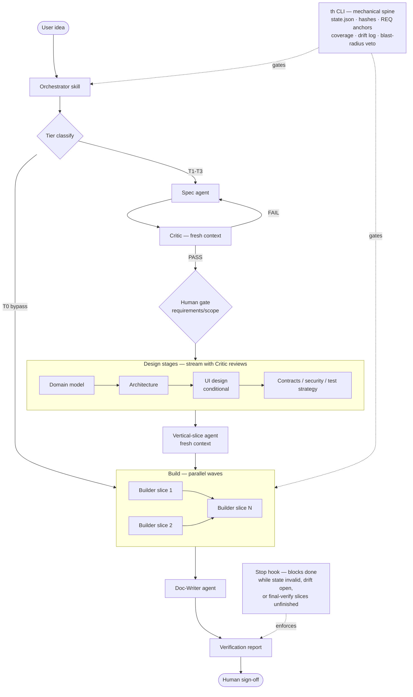

# TwinHarness

**Turns "build me X" into working, tested software** by forcing the idea through requirements, scope, design, and slice-by-slice implementation with verification gates — as a Claude Code plugin.

> **Early development notice.** TwinHarness is at v0.6.x. The pipeline has been exercised end-to-end and ships 392 passing tests, but it has limited real-world mileage and interfaces may change before 1.0. Expect breaking changes. Use it, push its limits, file issues — just don't bet a production release on it yet.

---

## What it is

TwinHarness is a Claude Code plugin: an agentic SDLC orchestrator that takes a vague software idea and produces working, tested software through a disciplined pipeline. It coordinates 9 specialized agents — Orchestrator, Spec, Critic, Vertical-Slice, Builder, UI-Designer, Doc-Writer, plus an on-demand Researcher (conditional, source-cited) and Debugger (evidence-first defect tracer) — and backs them with a deterministic TypeScript CLI (`th`) that handles every mechanical operation: state, content hashing, REQ-ID traceability, coverage gates, the drift log, and a Stop hook that blocks Claude from claiming "done" while state is invalid or a blocking discovery is open.

Three things make it different from asking an agent to build something directly:

- **Artifacts govern; they don't decorate.** Every stage produces a document that downstream stages are mechanically checked against. When reality diverges during the build, the document updates — in both directions.
- **The process scales with risk, not ceremony.** A trivial change bypasses everything (Tier 0). A project touching auth, money, or migrations gets the strictest treatment, and that floor is enforced by code, not by promises.
- **Mechanical truths are code.** State, hashing, coverage, drift counts, and the completion gate live in a tested CLI — not in prompt text a model could misremember.

**Who it's for:** Claude Code users who want spec-driven, gated development instead of one-shot vibe-coding; people burned by agents that build the wrong thing or claim "done" when they aren't; teams that need traceability from requirements to code.

---

## What a run looks like

Start with:

```
/twinharness:th-run build a CLI tool that tracks my reading list
```

Then, roughly:

1. **Scaffolding.** The Orchestrator initializes `docs/`, `.twinharness/state.json`, and `drift-log.md` in your project directory.
2. **Requirements.** A Spec agent drafts requirements, assigns REQ-IDs, and asks you only the questions that matter. A fresh-context Critic reviews the draft.
3. **Your first gate.** You see the requirements and are asked to approve or request changes. Once you sign off, requirements are sticky — only you can reopen them.
4. **Tier classification.** The Orchestrator sizes the project (Tier 0–3). Trivial → Tier 0 bypass. Risky blast-radius work → Tier 3 with more gates and more expensive models.
5. **Design stages stream.** Domain model, architecture, contracts, security/failure analysis, and test strategy run with Critic reviews but without interrupting you — except for genuinely irreversible choices (e.g. monolith vs. services) and blast-radius decisions (e.g. the auth scheme). If your project has a UI, the UI-Designer presents 2–3 design directions and asks you to pick one.
6. **Vertical slices, then build.** A fresh-context agent decomposes the design into thin end-to-end slices. Builders implement them one-by-one (in conflict-free parallel waves when slices are independent), tests included, with a Critic after each.
7. **Documentation.** A Doc-Writer agent generates tier-appropriate docs. Critic-reviewed; no human gate.
8. **Verification.** A final report separates what the Critic can certify (coherence) from what only tests and you can certify (correctness). You sign off.

### Architecture



---

## Getting started

**Prerequisites:** Claude Code; Node >= 18 on PATH.

### Install

The repo is its own single-plugin marketplace. From a local clone:

```
/plugin marketplace add C:\path\to\TwinHarness
/plugin install twinharness@twinharness
```

From GitHub directly:

```
/plugin marketplace add JrSneed28/TwinHarness
/plugin install twinharness@twinharness
```

For a throwaway trial without installing:

```
claude --plugin-dir C:\path\to\TwinHarness
```

The plugin installs at user scope and is available in every project.

### First run

Open Claude Code in the directory where you want the software built (an empty directory is fine):

```
/twinharness:th-run build a CLI tool that tracks my reading list
```

### Slash commands

| Command | What it does |
|---|---|
| `/twinharness:th-run <idea>` | Start a new run, or resume an interrupted one (it picks up from `state.json`) |
| `/twinharness:th-status` | Tier, current stage, gates, slices, open drift — at a glance |
| `/twinharness:th-drift` | Review the drift log: skim auto-applied doc updates, decide blocked escalations |
| `/twinharness:th-escalate` | Show everything currently waiting on a human decision |

### Run the test suite (from a clone)

```
npm install
npm test
```

The full guide — tiers, stages, the Critic loop, drift, gates, and the complete CLI reference — is in [USAGE.md](./USAGE.md).

---

## Features

- **Tier scaling with Tier-0 bypass.** Trivial changes skip the full pipeline. The Orchestrator classifies the project before running any stages, and communicates exactly which stages will run.
- **Blast-radius floor.** Projects touching auth, money, migrations, or data integrity can never skip process — this floor is enforced by the `th tier veto-check` command, not by prompt instructions.
- **Fresh-context Critic reviews with capped revise loops.** Each major artifact is reviewed in an independent context to avoid anchoring bias. Revise loops are capped (default 3 rounds) and escalate to a human if the cap is reached.
- **REQ-ID traceability.** Every requirement gets a stable ID (`REQ-001`, `REQ-002`, …) that anchors to slices, tests, and source code. `th anchors scan` maps the full picture; `th trace render` produces the traceability view on demand without maintaining a stored matrix.
- **Bidirectional drift log.** Discoveries during the build flow back into the governing artifacts. Non-blocking changes auto-apply; requirement-layer changes increment a counter that the Stop hook reads to refuse premature completion.
- **Vertical slices with a walking skeleton.** Each slice is a thin, end-to-end capability. `th build plan` schedules slices into conflict-free parallel waves: disjoint component sets run in the same wave, overlapping components serialize to prevent drift races.
- **Stop hook.** Claude is blocked by default from claiming completion while `state.json` is invalid, a blocking drift entry is open, or — at the final-verification stage — any slice is not yet `done`/`blocked`. The completion check fires only at final-verification, so mid-build pauses are never interrupted. The gate is code (`th hook stop-gate`), not a prompt reminder.
- **PreToolUse write-gate.** Blocks the standard Write/Edit/NotebookEdit path by default — before the pre-build gates clear and across slice-component boundaries during the build. A second, conservative `Bash` matcher catches obvious shell writes (`>`, `>>`, `tee`, `dd of=`, `sed -i`) into implementation paths pre-implementation; Bash writes remain out of scope as a *guarantee* (see `spec/write-gate-design.md` and `SECURITY.md`). The gate is fail-open (non-TwinHarness projects are completely unaffected), configurable (`ask` / `deny` / `off`, default `ask`), and one click to allow in a manual session.
- **Gate-mutation audit ledger.** Every gate-relevant state change (`implementation_allowed`, tier, blast-radius flags, write-gate mode, blocking drift opened/resolved) is appended to `.twinharness/gate-ledger.jsonl` with a timestamp. The gates bind a compliant agent; the ledger makes any override reviewable after the fact. `drift_open_blocking` is additionally a *managed field*: `th state set` refuses it — only `th drift add`/`th drift resolve` move it.
- **Safe parallel builds, coordinated.** Concurrent `th` invocations (parallel Builders in a wave) serialize their state mutations under a cross-process lock, so no `drift add` or slice-status update is ever lost to a race. `th build next-wave` is the live oracle for which slices are dispatchable in parallel right now (dependencies done, components free); `th build claim`/`release` add dynamic component leases that refuse an overlapping claim — the collision guard that closes the drift-expanded-component race the static plan can't see. Slices may declare `depends_on` for true ordering beyond component disjointness. One coordinator (the Orchestrator) drives N Builders — no second controller to collide with.
- **On-demand Researcher and Debugger agents.** A conditional **Researcher** (only when a project needs unfamiliar external knowledge) gathers source-cited evidence into `docs/00-research/`, Critic-checked in `research` mode against fabrication and uncited claims. An evidence-first **Debugger** engages on a failing suite or grounded defect: `th debug pack` assembles the failure bundle, `th debug log` is its append-only evidence ledger, and `debug-review` Critic mode rejects an unanchored root cause. Both compute/record through `th`; they propose, they don't decide.
- **Self-diagnostics and run inspection.** `th doctor` is a full run-health audit (environment, artifact integrity, coverage, slice progress, revise escalations); `th next` returns the single mechanical obligation the run owes next; `th stage current` returns the mechanical contract of the current stage (produces / Critic mode / human gate); `th coverage report` gives the planned/implemented/tested/passing breakdown; `th context pack` assembles the §9 handoff bundle; `th manifest export` emits a deterministic snapshot of the whole run; `th context estimate` reports prompt-surface token cost; `th migrate` upgrades `state.json` across schema versions.
- **Conditional UI-design stage.** Present only when the project has a user interface. The UI-Designer presents 2–3 distinct design directions and asks you to pick one before streaming the detailed design.
- **Tier-scaled documentation.** T1 gets a readme; T2 adds a user guide and API reference; T3 gets the full suite. A Critic reviews the docs; no human gate required.
- **Automatic model routing.** Cheap models handle routine work; expensive ones (Opus) handle high-risk stages, blast-radius reviews, and the Orchestrator. Haiku handles trivial summarization. The full routing policy is in `skills/twinharness/SKILL.md`.

---

## The `th` CLI

`th` is a zero-dependency TypeScript CLI that owns every mechanical operation in a TwinHarness run. It records and computes — it never decides which stage, agent, or tier runs. Those are the Orchestrator's calls.

| Command group | Purpose |
|---|---|
| `th init` | Scaffold `docs/`, `.twinharness/state.json`, `drift-log.md` |
| `th state get\|set\|status\|verify` | Read, patch, snapshot, or validate `state.json` |
| `th tier classify\|veto-check` | Advisory tier eligibility check; mechanical blast-radius veto (exit 3) |
| `th artifact register\|list` | Content-hash and record approved artifacts (file **or** directory, e.g. the ADR set) |
| `th coverage check` / `th coverage report` | Gate: every MVP REQ-ID maps to ≥1 slice and ≥1 test · Report: planned/implemented/tested/passing breakdown |
| `th verify add\|list\|clear\|run` | Configure and run the project's own test/check commands; records a green/failing report |
| `th slices sync` / `th slice set-status` | Upsert slices from the implementation plan; update status |
| `th build plan` / `th build next-wave` | Schedule slices into conflict-free waves · live oracle for the slices dispatchable in parallel right now |
| `th build claim\|release\|leases` | Dynamic component leases — the collision guard for parallel Builders (refuses overlapping claims) |
| `th debug pack` / `th debug log` | Assemble a read-only failure-evidence bundle · append-only evidence ledger for the Debugger agent |
| `th anchors scan` / `th trace render` / `th stale` | Map REQ anchors, render traceability, compute cascade-stale set |
| `th drift add\|list\|resolve` | Append, list, and resolve bidirectional drift entries |
| `th revise bump\|status\|reset` | Manage revise-loop counts and escalation |
| `th hook stop-gate` | Emit the Claude Code Stop-hook decision |
| `th hook pretool-gate` | Emit the Claude Code PreToolUse-hook decision (write-gate, incl. the Bash matcher) |
| `th stage current\|describe\|list` | The mechanical per-stage contract: produces / Critic mode / human gate |
| `th doctor` | Run-health audit: environment, state validity, artifact integrity, coverage, slices, revise loops, locks, ledger |
| `th next` | Next-action oracle: the single mechanical obligation the run owes next |
| `th manifest export` | Deterministic run snapshot (state + drift + gate ledger) for review or golden CI checks |
| `th context estimate` / `th context pack` | Approximate prompt-surface token cost · assemble the §9 slice/agent handoff bundle |
| `th migrate` | Upgrade `state.json` to the current schema version (forward-only) |

All commands accept `--json` for machine-readable output. The full reference is in [USAGE.md](./USAGE.md) Part 3.

---

## Status

**What works today:**

- Full T0–T3 pipeline, all 9 agents, all stages.
- `th` CLI with 392 passing tests covering CLI behavior, plugin-packaging integrity, security containment (path traversal, proto-pollution), and a real cross-process concurrency race test; CI runs typecheck, build, a dist-sync assertion, and the full suite on every push and PR.
- Validated Claude Code plugin packaging (`claude plugin validate` + `--plugin-dir` load pass).
- PreToolUse write-gate: blocks the Write/Edit/NotebookEdit path by default before gates clear and across slice-component boundaries during the build, plus a conservative pre-implementation Bash matcher; Bash writes remain out of scope as a guarantee (v0.3.0+).
- Gate-mutation audit ledger, managed drift counter, schema-versioned state with `th migrate`, and run inspection via `th doctor` / `th stage` / `th manifest export` / `th context estimate`.
- Context-budgeted prompts: every always-loaded skill/agent file fits Claude Code's ~500-line / ~5k-token guidance; per-stage and per-mode detail loads on demand from `skills/twinharness/reference/`.
- A complete worked example: `examples/autocoder/` — a T3 run producing an autocoder CLI tool, 11 slices, Stage 11 verified and human-signed.

**Not yet done:**

- **Limited real-world mileage.** The pipeline has been exercised on internal examples but not yet validated across a broad range of real projects.
- **Breaking changes before 1.0.** Artifact schemas, state fields, and CLI flags may change.

---

## Repository structure

```
.claude-plugin/   plugin manifest and marketplace.json
.github/          CI (typecheck, build, dist-sync assertion, full test suite)
agents/           9 agent prompt files (lean cores; detail lives in skills/twinharness/reference/)
commands/         4 slash command definitions
dist/             compiled CLI — ships in git (no build step at install time)
hooks/            hook wiring (hooks.json → th hook stop-gate / pretool-gate)
schemas/          published JSON Schemas for state.json and brief.json
skills/           twinharness/SKILL.md (lean Orchestrator core) + reference/ (on-demand playbook detail)
spec/             design spec (TwinHarness-Plan.md) and the write-gate design
src/              TypeScript source for the th CLI
templates/        artifact skeletons for each SDLC stage
tests/            REQ-anchored vitest suite
examples/         complete worked example (autocoder T3 run)
```

The agents and skill are the brains; `src/dist` is the mechanical spine; `templates/` are the artifact skeletons; `hooks/` is the completion gate. Deeper documentation lives in [USAGE.md](./USAGE.md) and [spec/](./spec/).

---

## Contributing

```
git clone https://github.com/JrSneed28/TwinHarness.git
cd TwinHarness
npm install
npm run build
npm test
```

`dist/` ships in git because plugin installs copy the repo as-is with no build step. If you change anything in `src/`, run `npm run build` and commit `dist/` together with the source — `tests/plugin-manifest.test.ts` enforces this mechanically, and CI asserts `git diff --exit-code dist/` on every push.

The full contributor guide (packaging invariants, conventions, where things live) is in [CONTRIBUTING.md](./CONTRIBUTING.md); the threat model and vulnerability-reporting process are in [SECURITY.md](./SECURITY.md).

Issues and pull requests are welcome: [github.com/JrSneed28/TwinHarness/issues](https://github.com/JrSneed28/TwinHarness/issues).

---

## License

MIT

---

## Links

- [USAGE.md](./USAGE.md) — full usage guide, from install through advanced CLI reference
- [CHANGELOG.md](./CHANGELOG.md) — version history
- [SECURITY.md](./SECURITY.md) — threat model, trust boundaries, vulnerability reporting
- [CONTRIBUTING.md](./CONTRIBUTING.md) — dev setup and packaging invariants
- [spec/TwinHarness-Plan.md](./spec/TwinHarness-Plan.md) — design spec
- [spec/write-gate-design.md](./spec/write-gate-design.md) — PreToolUse write-gate design (implemented in v0.3.0)
- [GitHub issues](https://github.com/JrSneed28/TwinHarness/issues)

---

[](CHANGELOG.md) [](LICENSE)  
